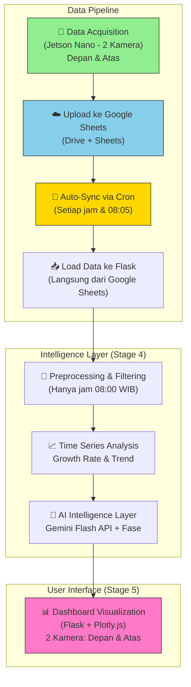

<h1 align="center">
  📊 Time Series Dashboard Bawang Merah<br>
  <sub>Stage 4 & 5: Intelligence Layer + User Visualization</sub>
</h1>

<p align="center">
  <a href="#">
    
  </a>
  <a href="https://flask.palletsprojects.com/">
    
  </a>
  <a href="#">
    
  </a>
  <a href="#">
    
  </a>
  <a href="#">
    
  </a>
  <a href="#">
    
  </a>
</p>

<p align="center">
  Sistem <b>Time Series Citra</b> untuk monitoring tanaman bawang merah berbasis foto harian pukul 08:00 WIB.<br>
  Fokus pada <b>analisis pertumbuhan</b>, <b>prediksi tren</b>, <b>assessment risiko</b>, <b>fase pertumbuhan</b>, serta 
  <b>visualisasi dashboard</b> yang informatif dan actionable.
</p>

**🌐 Live Demo:** [https://ucaucil.site/dashboard/](https://ucaucil.site/dashboard/)

---

## 🎯 Tujuan Stage 4 & 5

- **Stage 4**: Intelligence Layer – Time Series Analysis, Growth Rate, Trend Prediction, Estimasi Sisa Hari Panen, Risk Assessment, dan **Fase Pertumbuhan Bawang Merah**.
- **Stage 5**: User Dashboard – Visualisasi foto asli (2 kamera: Depan + Atas), grafik pertumbuhan interaktif (Plotly), countdown panen, dan laporan AI berbasis Gemini.

---

## 🧅 Informasi Varietas

Dashboard ini dikonfigurasi untuk **Bawang Merah Banyuwangi** dengan spesifikasi:

| Properti | Keterangan |
|----------|-------------|
| **Nama** | Bawang Merah Banyuwangi |
| **Jenis** | Varietas Lokal Banyuwangi |
| **Karakteristik** | Umbi merah kecoklatan, rasa tajam, cocok untuk bumbu dasar |
| **Umur Panen** | 60-65 HST |
| **Daerah Asal** | Banyuwangi, Jawa Timur |

---

## 🌱 Fase Pertumbuhan Bawang Merah

Sistem mendeteksi 7 fase pertumbuhan berdasarkan usia tanaman (HST):

| Fase | Umur (HST) | Keterangan | Rekomendasi |
|------|------------|------------|--------------|
| 🌱 Fase Adaptasi & Tumbuh Tunas | 0–7 hari | Umbi mulai bertunas dan akar mulai keluar | Pastikan kelembaban tanah terjaga, hindari genangan air |
| 🌿 Fase Vegetatif Awal | 8–20 hari | Daun bertambah cepat, akar makin kuat | Berikan pupuk nitrogen untuk merangsang pertumbuhan daun |
| 🍃 Fase Vegetatif Maksimal | 21–35 hari | Jumlah daun banyak, anakan mulai terbentuk | Pertahankan kelembaban, waspadai hama ulat |
| 🧅 Fase Pembentukan Umbi | 36–50 hari | Energi mulai dialihkan ke pembentukan umbi | Kurangi penyiraman, berikan pupuk fosfor dan kalium |
| 📈 Fase Pembesaran Umbi | 51–65 hari | Umbi membesar cepat dan mulai padat | Jaga kebersihan dari gulma, hindari stres air |
| 🏆 Fase Pematangan | 66–75 hari | Daun mulai rebah/menguning, kulit umbi mengering | Hentikan penyiraman, bersiap panen |
| 🎉 Panen | >75 hari | Umbi siap dipanen | Lakukan panen saat cuaca cerah, pagi atau sore hari |

### Tanda Bawang Merah Siap Panen:
- ±70–90% daun mulai rebah/menguning
- Umbi sudah padat dan berwarna merah mengkilap
- Leher batang mulai mengecil dan lunak
- Kulit umbi tidak mudah terkelupas

---

## 🔄 Alur Kerja Keseluruhan (Flow Diagram)



---

## 🖥️ Penjelasan UI Dashboard

Dashboard dibagi menjadi beberapa section utama:

### 1. **Header & Informasi Varietas**
- Judul Dashboard
- Informasi varietas Bawang Merah Banyuwangi
- Status tanaman saat ini (HST - Hari Setelah Tanam)
- Last update timestamp (auto-refresh setiap 5 menit)

### 2. **Fase Pertumbuhan Card**
- **Nama fase** saat ini (dengan icon)
- **Deskripsi fase** dan usia tanaman (HST)
- **Progress bar** menunjukkan progres dalam fase saat ini
- **Rekomendasi perawatan** spesifik untuk fase tersebut
- **Grid 7 fase** (fase aktif akan terhighlight)

### 3. **Metrik Real-time** (4 Kolom)
- **Progress Menuju Panen** (persentase dan estimasi hari)
- **Suhu Real-time Tangerang** (Open-Meteo API)
- **Suhu Lahan pukul 08:00 WIB** (dari data historis)
- **Ancaman Tertinggi** (Penyakit dominan beserta Confidence Score)

### 4. **Tanda Bawang Siap Panen**
- Daftar ciri-ciri fisik bawang merah yang sudah siap panen

### 5. **Analisis Tren & Prediksi AI** (Bagian Utama)
- **Grafik Time Series Interaktif (Plotly)**: 
  - Confidence Score Kamera Depan sebagai indikator pertumbuhan
  - Garis tren (rolling average 3 hari) untuk prediksi
- **Laporan AI Gemini Flash** dengan analisis:
  - 🌱 Fase Saat Ini
  - 🚨 Analisa Kesehatan
  - 📈 Prediksi 3 hari ke depan
  - 🛠️ Rekomendasi Tindakan

### 6. **Galeri Foto Asli** (2 Posisi)
- Foto terbaru dari **Kamera Depan** (dengan penggaris) dan **Kamera Atas** (kanopi)
- Informasi lengkap: Tanggal, Posisi, Nama Penyakit, Confidence Score
- Gambar di-load via Google Drive Thumbnail API

### 7. **Tabel Database Log**
- **Auto Log**: Data dari Jetson (hanya menampilkan data hari ini jam 08:00 WIB)
- **Manual Log**: Data input manual dari teknisi
- Kolom: Waktu, Posisi, Nama Penyakit, Confidence (%), Suhu (°C)
- Tampilan tabel yang rapi dengan hover effect

---

## 📁 Struktur Direktori

```bash
timeseries-dashboard/
├── dashboard_flask.py           # Aplikasi Flask utama
├── sync_google_sheets.py        # Script auto-sync dari Google Sheets
├── data_bawang.csv              # Cache data lokal (auto-generated)
├── data_manual.csv              # Data input manual
├── requirements.txt
├── .env                         # Konfigurasi (API Key, Google Sheets URL)
├── venv-minimal/                # Virtual environment (Python 3.9)
├── uploads/                     # Folder temporary upload manual
├── sync_log.txt                 # Log auto-sync
└── README.md
```

---

## 🚀 Cara Menjalankan

### Prasyarat
- Python 3.9 atau lebih rendah (kompatibel dengan CPU lawas)
- Koneksi internet (untuk akses Gemini API, Google Sheets, dan Open-Meteo)
- Nginx + Gunicorn (untuk production deployment)
- Google Cloud Platform account (untuk Gemini API)

### Langkah 1: Clone Repository & Setup Environment

```bash
git clone https://github.com/your-repo/timeseries-dashboard.git
cd timeseries-dashboard

# Buat virtual environment dengan Python 3.9
python3.9 -m venv venv-minimal
source venv-minimal/bin/activate

# Install dependencies
pip install -r requirements.txt
```

### Langkah 2: Konfigurasi Environment (.env)

Buat file `.env` di root folder:

```env
# Gemini API Key (dapatkan dari Google AI Studio)
GEMINI_API_KEY=xxxxxxxxxxxxxxxxxxxxxxxxxxx

# Google Sheets URL Export CSV
GOOGLE_SHEETS_URL=https://docs.google.com/spreadsheets/d/xxxxxxxxxxxxxxxxxxxxxxxxxxxxxxxxxxx/export?format=csv
```

### Langkah 3: Setup Auto-Sync Data (Cron Job)

```bash
# Edit crontab
crontab -e

# Tambahkan baris berikut:
# Sync setiap jam
0 * * * * cd /home/server/timeseries-dashboard && /home/server/timeseries-dashboard/venv-minimal/bin/python sync_google_sheets.py >> sync_log.txt 2>&1

# Sync khusus jam 08:05 (setelah data pagi masuk)
5 8 * * * cd /home/server/timeseries-dashboard && /home/server/timeseries-dashboard/venv-minimal/bin/python sync_google_sheets.py

# Restart dashboard setelah sync
10 8 * * * sudo systemctl restart dashboard-flask
```

### Langkah 4: Konfigurasi HST (Usia Tanaman)

Edit variabel `FORCE_HST` di `dashboard_flask.py`:

```python
# ==========================================
# KONFIGURASI HST (USIA TANAMAN)
# ==========================================
FORCE_HST = 2  # Sesuaikan dengan usia tanaman saat ini
TARGET_PANEN_MIN = 60
TARGET_PANEN_MAX = 65
```

### Langkah 5: Jalankan Dashboard

**Development Mode (Testing):**
```bash
python dashboard_flask.py
```

**Production Mode (Gunicorn + Nginx):**
```bash
# Setup systemd service
sudo nano /etc/systemd/system/dashboard-flask.service
```

Isi dengan:
```ini
[Unit]
Description=Flask Dashboard for Bawang
After=network-online.target

[Service]
User=server
Group=server
WorkingDirectory=/home/server/timeseries-dashboard
EnvironmentFile=/home/server/timeseries-dashboard/.env
Environment="PATH=/home/server/timeseries-dashboard/venv-minimal/bin"

ExecStart=/home/server/timeseries-dashboard/venv-minimal/bin/gunicorn -b 127.0.0.1:8501 --workers 2 dashboard_flask:app

Restart=always
RestartSec=5

[Install]
WantedBy=multi-user.target
```

```bash
# Start service
sudo systemctl daemon-reload
sudo systemctl enable dashboard-flask
sudo systemctl start dashboard-flask

# Konfigurasi Nginx (proxy ke port 8501)
sudo nano /etc/nginx/sites-available/default
```

Tambahkan konfigurasi:
```nginx
location /dashboard/ {
    proxy_pass http://127.0.0.1:8501/;
    proxy_http_version 1.1;
    proxy_set_header Host $host;
    proxy_set_header X-Real-IP $remote_addr;
    proxy_set_header X-Forwarded-For $proxy_add_x_forwarded_for;
    proxy_set_header X-Forwarded-Proto $scheme;
    proxy_set_header X-Script-Name /dashboard;
    proxy_redirect off;
}

location = /dashboard {
    return 301 /dashboard/;
}
```

```bash
sudo nginx -t && sudo systemctl reload nginx
```

### Langkah 6: Akses Dashboard

- **Via Domain:** https://ucaucil.site/dashboard/
- **Via IP Lokal:** http://localhost:8501
- **Via Tailscale:** http://100.xx.xx.xxx:8501

---

## 🔧 Auto-Sync Data dari Google Sheets

Dashboard secara otomatis sinkron dengan Google Sheets melalui:

1. **Cron Job** (setiap jam dan khusus jam 08:05)
2. **Fallback ke file lokal** jika Google Sheets tidak reachable
3. **Auto-refresh halaman** setiap 5 menit (meta refresh)

**Cara Manual Sync:**
```bash
cd ~/timeseries-dashboard
source venv-minimal/bin/activate
python sync_google_sheets.py
```

---

## 📝 Fitur Manual Input

Dashboard menyediakan fitur input manual untuk situasi dimana Jetson offline:

- **Akses:** https://ucaucil.site/dashboard/manual-input
- **Input data:** Tinggi tanaman (cm), kondisi jamur, catatan
- **Auto-analisis** dengan Gemini AI
- **Data tersimpan** di `data_manual.csv` dan muncul di dashboard

---

## 🛠️ Teknologi yang Digunakan

### Backend
- **Flask 2.0+** – Web framework ringan
- **Gunicorn** – WSGI HTTP Server untuk production
- **Nginx** – Reverse proxy & load balancer
- **Pandas** – Data processing & time series analysis
- **python-dotenv** – Manajemen environment variable

### Frontend
- **Plotly.js** – Grafik interaktif (rendered client-side)
- **HTML5/CSS3** – Styling custom (dark theme industrial)
- **Meta refresh** – Auto-refresh data setiap 5 menit

### APIs & Integrations
- **Google Gemini Flash** – AI Intelligence Layer (laporan analisis & fase)
- **Google Sheets API (Public CSV)** – Sumber data utama
- **Google Drive Thumbnail API** – Menampilkan foto dari Google Drive
- **Open-Meteo API** – Data cuaca real-time Tangerang

### Deployment
- **Ubuntu 24.04+** – OS Server
- **Systemd** – Service management
- **Tailscale** – VPN untuk akses internal

---

## 📌 Catatan Penting

- **Filter Data**: Dashboard hanya menampilkan data pukul **08:00 WIB** (data resmi harian)
- **2 Kamera**: Hanya menampilkan kamera **Depan** (penggaris) dan **Atas** (kanopi)
- **Varietas**: Dikonfigurasi untuk **Bawang Merah Banyuwangi** (panen 60-65 HST)
- **Fase Pertumbuhan**: 7 fase dengan deteksi otomatis berdasarkan HST
- **Target Panen**: 60-65 HST (fleksibel tergantung kondisi)
- **Kompatibilitas**: Dioptimalkan untuk CPU lawas (AMD Turion II) dengan menghindari pyarrow & binary packages modern
- **Auto-Sync**: Data otomatis sync dari Google Sheets tanpa perlu download/upload manual

---

## 🐛 Troubleshooting

### Masalah: Grafik tidak muncul
```bash
# Cek data di Google Sheets
curl -L "https://docs.google.com/spreadsheets/d/xxxxxxxxxxxxxxxxxxxxxxxxxxxx/export?format=csv" | head -10

# Restart service
sudo systemctl restart dashboard-flask
```

### Masalah: Laporan AI error
- Pastikan URL endpoint menggunakan `gemini-flash-latest`
- Cek API Key di `.env` sudah benar
- Test API Key: `python -c "from dashboard_flask import get_api_key; print(get_api_key())"`

### Masalah: Data tidak update hari ini
```bash
# Jalankan sync manual
cd ~/timeseries-dashboard
source venv-minimal/bin/activate
python sync_google_sheets.py

# Cek log cron
tail -20 sync_log.txt

# Pastikan Jetson mengambil foto jam 08:00 WIB
```

### Masalah: Usia tanaman tidak sesuai
Edit `FORCE_HST` di `dashboard_flask.py`:
```python
FORCE_HST = 2  # Ubah sesuai kebutuhan
```

---

## 🔮 Rencana Pengembangan Selanjutnya

- [ ] **Model forecasting** time series dengan Prophet/ARIMA
- [ ] **Prediksi pertumbuhan** tinggi tanaman menggunakan ruler detection otomatis
- [ ] **Sistem notifikasi** risiko via Telegram/WhatsApp
- [ ] **Export laporan** PDF otomatis
- [ ] **Multi-lahan** comparison dashboard
- [ ] **Dark/Light theme** toggle
- [ ] **Mobile-responsive** design improvement
- [ ] **Integrasi sensor tanah** (kelembaban, pH)

---

## 📊 Sumber Data

- **Google Sheets:** [Data Bawang Time Series](https://docs.google.com/spreadsheets/d/xxxxxxxxxxxxxxxxxxxx/edit)
- **Gemini API:** [Google AI Studio](https://aistudio.google.com/)
- **Weather API:** [Open-Meteo](https://open-meteo.com/)

---

## 👥 Kontributor

- **UCA-UCIL Creative Tech** – Junior Field Engineer & IoT Developer

---

**Dibuat untuk monitoring presisi tanaman bawang merah berbasis citra dan time series analysis.**

**Last Updated:** 9 Mei 2026  
**Versi:** Stage 4 & 5 (Production Ready)  
**Platform:** Flask + Gunicorn + Nginx  
**Varietas:** Bawang Merah Banyuwangi  
**Target Panen:** 60-65 HST  
**Status:** ✅ Fully Operational

---

## 📜 Lisensi

<div align="center">
  
**© 2026 UCA-UCIL Creative Tech. All rights reserved.**

<p><a href="#top">⬆ Back on Top</a></p>

</div>
