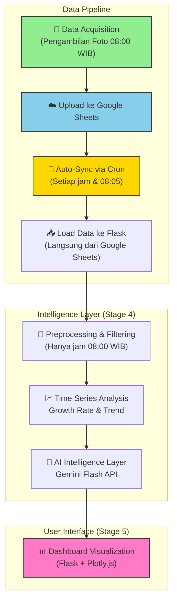

Berikut **README.md** yang sudah diperbaiki dan disesuaikan dengan implementasi **Flask** (bukan Streamlit) yang berjalan di server dengan **auto-sync dari Google Sheets**:

```markdown
<h1 align="center">
  📊 Time Series Dashboard Bawang Merah<br>
  <sub>Stage 4 & 5: Intelligence Layer + User Visualization</sub>
</h1>

<p align="center">
  <a href="#">
    
  </a>
  <a href="https://flask.palletsprojects.com/">
    
  </a>
  <a href="#">
    
  </a>
  <a href="#">
    
  </a>
  <a href="#">
    
  </a>
</p>

<p align="center">
  Sistem <b>Time Series Citra</b> untuk monitoring tanaman bawang merah berbasis foto harian pukul 08:00 WIB.<br>
  Fokus pada <b>analisis pertumbuhan</b>, <b>prediksi tren</b>, <b>assessment risiko</b>, serta 
  <b>visualisasi dashboard</b> yang informatif dan actionable.
</p>

**🌐 Live Demo:** [https://ucaucil.site/dashboard/](https://ucaucil.site/dashboard/)

---

## 🎯 Tujuan Stage 4 & 5

- **Stage 4**: Intelligence Layer – Time Series Analysis, Growth Rate, Trend Prediction, Estimasi Sisa Hari Panen, dan Risk Assessment.
- **Stage 5**: User Dashboard – Visualisasi foto asli, grafik pertumbuhan interaktif (Plotly), countdown panen, dan laporan AI berbasis Gemini.

---

## 🔄 Alur Kerja Keseluruhan (Flow Diagram)



---

## 🖥️ Penjelasan UI Dashboard

Dashboard dibagi menjadi beberapa section utama:

### 1. **Header & Status Tanaman**
- Judul Dashboard
- Status tanaman saat ini (HST - Hari Setelah Tanam)
- Countdown hari menuju panen (`Target: 70 HST`)
- Last update timestamp (auto-refresh setiap 5 menit)

### 2. **Metrik Real-time** (4 Kolom)
- **Suhu Real-time Tangerang** (Open-Meteo API)
- **Suhu Lahan pukul 08:00 WIB** (dari data historis)
- **Usia Tanaman** (HST saat ini)
- **Ancaman Tertinggi** (Penyakit dominan beserta Confidence Score)

### 3. **Analisis Tren & Prediksi AI** (Bagian Utama)
- **Grafik Time Series Interaktif (Plotly)**: 
  - Confidence Score CAM0 (Kamera Depan) sebagai indikator pertumbuhan
  - Garis tren (rolling average 3 hari) untuk prediksi
- **Laporan AI Gemini Flash**:
  - 🚨 Analisa ancaman
  - 📈 Prediksi 3 hari ke depan
  - 🛠️ Tindakan lapangan yang disarankan

### 4. **Galeri Foto Asli** (3 Posisi)
- Foto terbaru dari **Depan (CAM0)** , **Kanan (CAM1)** , dan **Atas (CAM2)**
- Informasi lengkap: Tanggal, Posisi, Nama Penyakit, Confidence Score
- Gambar di-load via Google Drive Thumbnail API

### 5. **Tabel Database Log**
- Menampilkan 20 data historis terakhir yang sudah difilter
- Kolom: Waktu, Posisi, Nama Penyakit, Confidence (%), Suhu (°C)
- Urutan descending (data terbaru di atas)

---

## 📁 Struktur Direktori

```bash
timeseries-dashboard/
├── dashboard_flask.py           # Aplikasi Flask utama
├── sync_google_sheets.py        # Script auto-sync dari Google Sheets
├── data_bawang.csv              # Cache data lokal (auto-generated)
├── requirements.txt
├── .env                         # Konfigurasi (API Key, Google Sheets URL)
├── venv-minimal/                # Virtual environment (Python 3.9)
├── update_log.txt               # Log auto-sync
└── README.md
```

---

## 🚀 Cara Menjalankan

### Prasyarat
- Python 3.9 atau lebih rendah (kompatibel dengan CPU lawas)
- Koneksi internet (untuk akses Gemini API, Google Sheets, dan Open-Meteo)
- Nginx + Gunicorn (untuk production deployment)

### Langkah 1: Clone Repository & Setup Environment

```bash
git clone https://github.com/your-repo/timeseries-dashboard.git
cd timeseries-dashboard

# Buat virtual environment dengan Python 3.9
python3.9 -m venv venv-minimal
source venv-minimal/bin/activate

# Install dependencies
pip install -r requirements.txt
```

### Langkah 2: Konfigurasi Environment (.env)

Buat file `.env` di root folder:

```env
# Gemini API Key (dapatkan dari Google AI Studio)
GEMINI_API_KEY=AIzaSyCt-S9HVhQm_d8Dxxxxxxxx

# Google Sheets URL Export CSV
GOOGLE_SHEETS_URL=https://docs.google.com/spreadsheets/d/YOUR_SHEET_ID/export?format=csv
```

### Langkah 3: Setup Auto-Sync Data (Cron Job)

```bash
# Edit crontab
crontab -e

# Tambahkan baris berikut:
# Sync setiap jam
0 * * * * cd /home/server/timeseries-dashboard && /home/server/timeseries-dashboard/venv-minimal/bin/python sync_google_sheets.py >> sync_log.txt 2>&1

# Sync khusus jam 08:05 (setelah data pagi masuk)
5 8 * * * cd /home/server/timeseries-dashboard && /home/server/timeseries-dashboard/venv-minimal/bin/python sync_google_sheets.py

# Restart dashboard setelah sync
10 8 * * * sudo systemctl restart dashboard-flask
```

### Langkah 4: Jalankan Dashboard

**Development Mode (Testing):**
```bash
python dashboard_flask.py
```

**Production Mode (Gunicorn + Nginx):**
```bash
# Setup systemd service
sudo nano /etc/systemd/system/dashboard-flask.service
```

Isi dengan:
```ini
[Unit]
Description=Flask Dashboard for Bawang
After=network-online.target

[Service]
User=server
Group=server
WorkingDirectory=/home/server/timeseries-dashboard
EnvironmentFile=/home/server/timeseries-dashboard/.env
Environment="PATH=/home/server/timeseries-dashboard/venv-minimal/bin"

ExecStart=/home/server/timeseries-dashboard/venv-minimal/bin/gunicorn -b 127.0.0.1:8501 --workers 2 dashboard_flask:app

Restart=always
RestartSec=5

[Install]
WantedBy=multi-user.target
```

```bash
# Start service
sudo systemctl daemon-reload
sudo systemctl enable dashboard-flask
sudo systemctl start dashboard-flask

# Konfigurasi Nginx (proxy ke port 8501)
sudo nano /etc/nginx/sites-available/default
# Tambahkan location /dashboard/ { proxy_pass http://127.0.0.1:8501/; ... }

sudo nginx -t && sudo systemctl reload nginx
```

### Langkah 5: Akses Dashboard

- **Via Domain:** https://ucaucil.site/dashboard/
- **Via IP Lokal:** http://localhost:8501
- **Via Tailscale:** http://100.64.25.105:8501

---

## 🔧 Auto-Sync Data dari Google Sheets

Dashboard secara otomatis sinkron dengan Google Sheets melalui:

1. **Cron Job** (setiap jam dan khusus jam 08:05)
2. **Fallback ke file lokal** jika Google Sheets tidak reachable
3. **Auto-refresh halaman** setiap 5 menit (meta refresh)

**Cara Manual Sync:**
```bash
cd ~/timeseries-dashboard
source venv-minimal/bin/activate
python sync_google_sheets.py
```

---

## 🛠️ Teknologi yang Digunakan

### Backend
- **Flask 2.0+** – Web framework ringan
- **Gunicorn** – WSGI HTTP Server untuk production
- **Nginx** – Reverse proxy & load balancer
- **Pandas** – Data processing & time series analysis
- **python-dotenv** – Manajemen environment variable

### Frontend
- **Plotly.js** – Grafik interaktif (rendered client-side)
- **HTML5/CSS3** – Styling custom (dark theme industrial)
- **Meta refresh** – Auto-refresh data setiap 5 menit

### APIs & Integrations
- **Google Gemini Flash** – AI Intelligence Layer (laporan analisis)
- **Google Sheets API (Public CSV)** – Sumber data utama
- **Google Drive Thumbnail API** – Menampilkan foto dari Google Drive
- **Open-Meteo API** – Data cuaca real-time Tangerang

### Deployment
- **Ubuntu 20.04+** – OS Server
- **Systemd** – Service management
- **Tailscale** – VPN untuk akses internal

---

## 📌 Catatan Penting

- **Filter Data**: Dashboard hanya menampilkan data pukul **08:00 WIB** (data resmi harian)
- **Tanggal Tanam**: Dikunci pada **28 April 2026**
- **Target Panen**: **70 HST** (Hari Setelah Tanam)
- **Kompatibilitas**: Dioptimalkan untuk CPU lawas (AMD Turion II) dengan menghindari pyarrow & binary packages modern
- **Auto-Sync**: Data otomatis sync dari Google Sheets tanpa perlu download/upload manual

---

## 🐛 Troubleshooting

### Masalah: Grafik tidak muncul
```bash
# Cek data di Google Sheets
curl -L "https://docs.google.com/spreadsheets/d/YOUR_SHEET_ID/export?format=csv" | head -10

# Restart service
sudo systemctl restart dashboard-flask
```

### Masalah: Laporan AI error "404"
- Pastikan URL endpoint menggunakan `gemini-flash-latest`
- Cek API Key di `.env` sudah benar
- Test API Key: `python -c "from dashboard_flask import get_api_key; print(get_api_key())"`

### Masalah: Data tidak update
```bash
# Jalankan sync manual
cd ~/timeseries-dashboard
source venv-minimal/bin/activate
python sync_google_sheets.py

# Cek log cron
tail -20 sync_log.txt
```

---

## 🔮 Rencana Pengembangan Selanjutnya

- [ ] **Model forecasting** time series dengan Prophet/ARIMA
- [ ] **Prediksi pertumbuhan** tinggi tanaman menggunakan ruler detection
- [ ] **Sistem notifikasi** risiko via Telegram/WhatsApp
- [ ] **Export laporan** PDF otomatis
- [ ] **Multi-lahan** comparison dashboard
- [ ] **Dark/Light theme** toggle
- [ ] **Mobile-responsive** design improvement

---

## 📊 Sumber Data

- **Google Sheets:** [Data Bawang Time Series](https://docs.google.com/spreadsheets/d/1QmA5L7Orq9XKpHBr4mm6xsF-dbRWHawIAx4ltt_QnDE/edit)
- **Gemini API:** [Google AI Studio](https://aistudio.google.com/)
- **Weather API:** [Open-Meteo](https://open-meteo.com/)

---

## 👥 Kontributor

- **UCA-UCIL Creative Tech** – Junior Field Engineer & IoT Developer

---

**Dibuat untuk monitoring presisi tanaman bawang merah berbasis citra dan time series analysis.**

**Last Updated:** 1 Mei 2026  
**Versi:** Stage 4 & 5 (Production Ready)  
**Platform:** Flask + Gunicorn + Nginx  
**Status:** ✅ Fully Operational

---

## 📜 Lisensi

© 2026 UCA-UCIL Creative Tech. All rights reserved.
