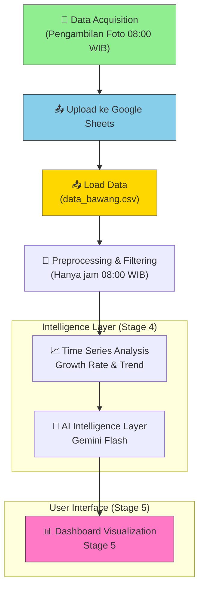

<h1 align="center">
  📊 Time Series Dashboard Bawang Merah<br>
  <sub>Stage 4 & 5: Intelligence Layer + User Visualization</sub>
</h1>

<p align="center">
  <a href="#">
    
  </a>
  <a href="https://streamlit.io">
    
  </a>
  <a href="#">
    
  </a>
  <a href="#">
    
  </a>
  <a href="#">
    
  </a>
</p>

<p align="center">
  Sistem <b>Time Series Citra</b> untuk monitoring tanaman bawang merah berbasis foto harian pukul 08:00 WIB.<br>
  Fokus pada <b>analisis pertumbuhan</b>, <b>prediksi tren</b>, <b>assessment risiko</b>, serta 
  <b>visualisasi dashboard</b> yang informatif dan actionable.
</p>

---

## 🎯 Tujuan Stage 4 & 5

- **Stage 4**: Intelligence Layer – Time Series Analysis, Growth Rate, Trend Prediction, Estimasi Sisa Hari Panen, dan Risk Assessment (Kekerian/Kematian).
- **Stage 5**: User Dashboard – Visualisasi foto asli, grafik pertumbuhan, countdown panen, dan laporan AI.

---

## 🔄 Alur Kerja Keseluruhan (Flow Diagram)



---

## 🖥️ Penjelasan UI Dashboard

Dashboard dibagi menjadi beberapa section utama:

### 1. **Header & Status Tanaman**
- Judul Dashboard
- Status tanaman saat ini (HST)
- Countdown hari menuju panen (`Target: 70 HST`)
- Highlight box dengan informasi penting

### 2. **Metrik Real-time** (4 Kolom)
- Suhu Real-time Tangerang (Open-Meteo)
- Suhu Lahan pukul 08:00 WIB
- Mode Sistem (`OTONOM`)
- Ancaman Tertinggi (Penyakit dominan)

### 3. **Analisis Tren & Prediksi AI** (Bagian Utama)
- **Grafik Time Series**: 
  - Confidence Score CAM0 (Depan) sebagai indikator pertumbuhan
  - Garis tren (rolling average)
- **Laporan AI Gemini**:
  - Analisa singkat
  - Prediksi 3 hari ke depan
  - Rekomendasi tindakan lapangan

### 4. **Galeri Foto Asli** (3 Sudut)
- Foto terbaru dari **CAM0 (Depan)**, **CAM1 (Kanan)**, dan **CAM2 (Atas)**
- Dilengkapi informasi: Tanggal, Posisi, Nama Penyakit, Confidence Score
- Gambar di-load via Google Drive Thumbnail

### 5. **Tabel Database Log**
- Menampilkan semua data historis yang sudah difilter
- Kolom: Waktu, Posisi, Nama Penyakit, Confidence, Suhu

---

## 📁 Struktur Direktori

```bash
timeseries-dashboard/
├── dashboard_timeseries.py      # Aplikasi Streamlit utama
├── data_bawang.csv              # Data dari Google Sheets
├── requirements.txt
├── .env                         # GEMINI_API_KEY
├── venv/
└── README.md
```

---

## 🚀 Cara Menjalankan

### Langkah 1: Install Dependencies

```bash
python -m venv venv
source venv/bin/activate
pip install -r requirements.txt
```

### Langkah 2: Konfigurasi API Key

Buat file `.env` di root folder:

```env
GEMINI_API_KEY=AIzxxxxxxxxxxxxxxxxxxxxxxxxxxxxxxxxx
```

### Langkah 3: Update Data Harian (Opsional)

```bash
curl -L "https://docs.google.com/spreadsheets/d/1QmA5L7Orq9XKpHBr4mm6xsF-dbRWHawIAx4ltt_QnDE/export?format=csv" \
  -o data_bawang.csv
```

### Langkah 4: Jalankan Dashboard

```bash
streamlit run dashboard_timeseries.py
```

Akses melalui browser:
- **Local**: http://localhost:8501
- **Network**: http://192.168.1.12:8501 (sesuaikan dengan IP kamu)

---

## 🛠️ Teknologi yang Digunakan

- **Streamlit** – Framework dashboard
- **Pandas & NumPy** – Data processing
- **Plotly** – Grafik interaktif
- **Google Gemini Flash** – AI Intelligence Layer
- **python-dotenv** – Manajemen environment variable
- **Open-Meteo API** – Data cuaca real-time

---

## 📌 Catatan Penting

- Dashboard hanya menampilkan data **pukul 08:00 WIB** (data resmi harian).
- Tanggal tanam dikunci pada **28 April 2026**.
- Target panen = **70 HST**.
- Pastikan koneksi internet stabil untuk mengakses Gemini API dan cuaca.

---

## 🔮 Rencana Pengembangan Selanjutnya

- [ ] Model forecasting time series (Prophet / ARIMA / LSTM)
- [ ] Prediksi pertumbuhan tinggi tanaman menggunakan ruler
- [ ] Sistem notifikasi risiko (Telegram)
- [ ] Halaman perbandingan antar lahan
- [ ] Export laporan PDF otomatis
- [ ] Dark/Light theme toggle

---

**Dibuat untuk monitoring presisi tanaman bawang merah berbasis citra dan time series.**

**Last Updated:** 30 April 2026  
**Versi:** Stage 4 & 5  
**Platform:** Streamlit

---
