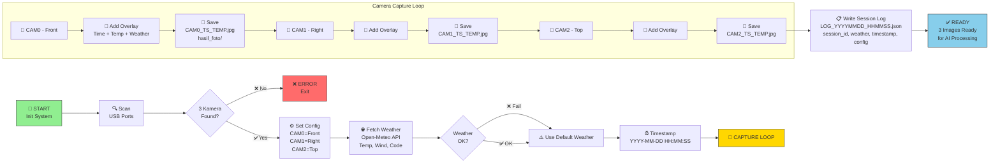
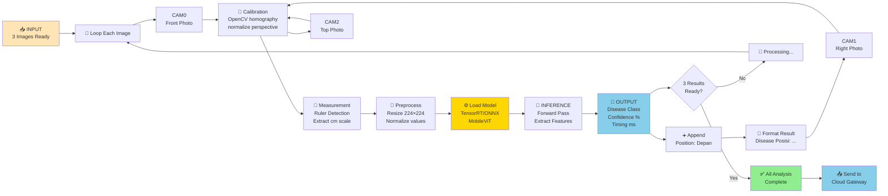
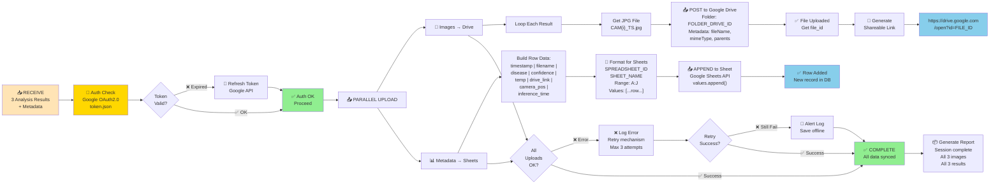
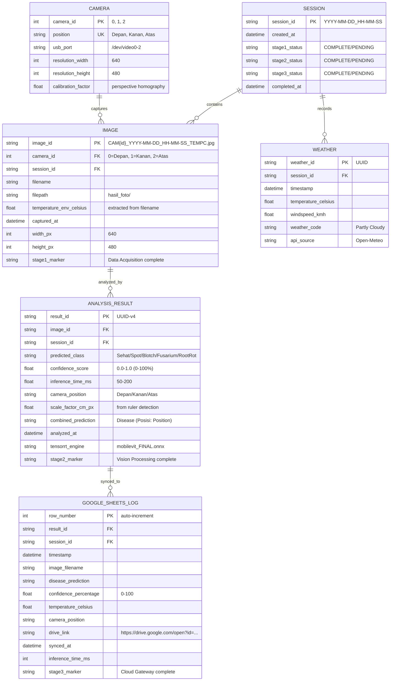

<h1 align="center">Time Series Multi-Sudut Stage 1-3</h1>

<p align="center">
  <a href="README.md">
    
  </a>
  <a href="https://python.org">
    
  </a>
  <a href="https://developer.nvidia.com/embedded/jetson">
    
  </a>
  <a href="https://onnx.ai">
    
  </a>
  <a href="https://cloud.google.com">
    
  </a>
  <a href="LICENSE">
    
  </a>
</p>

<p align="center">
  Sistem otomatis berbasis AI untuk mendeteksi penyakit pada tanaman bawang menggunakan <b>Jetson Nano</b> 
  dengan analisis multi-sudut real-time dan integrasi cloud. Pipeline terdiri dari <b>3 Stage Utama</b>: 
  Data Acquisition (Edge Layer), Vision Processing (AI Engine), dan Cloud Gateway.
</p>

## 📋 Daftar Isi
- [Fitur Utama](#fitur-utama)
- [3 Stage Utama](#-3-stage-utama)
  - [Stage 1: Data Acquisition](#stage-1-data-acquisition)
  - [Stage 2: Vision Processing](#stage-2-vision-processing)
  - [Stage 3: Cloud Gateway](#stage-3-cloud-gateway)
- [Arsitektur Sistem](#arsitektur-sistem)
- [Alur Kerja Keseluruhan](#alur-kerja-keseluruhan)
- [Database Schema](#database-schema)
- [Komponen Teknis](#komponen-teknis)
- [Instalasi & Setup](#instalasi--setup)
- [Penggunaan](#penggunaan)

---

## 🔀 3 STAGE UTAMA

Sistem terdiri dari 3 stage pipeline yang saling terintegrasi:

```
┌──────────────────────────────────────────────────────────────────────────┐
│                      ONION DISEASE DETECTION PIPELINE                    │
└──────────────────────────────────────────────────────────────────────────┘

STAGE 1: DATA ACQUISITION    STAGE 2: VISION PROCESS    STAGE 3: CLOUD GATEWAY
(Edge Layer)                 (Jetson AI Engine)         (Storage & Analysis)

┌─────────────────────┐    ┌──────────────────────┐   ┌─────────────────────┐
│  📸 CAPTURE LAYER   │    │   🤖 AI INFERENCE     │   │   ☁️ UPLOAD LAYER   │
├─────────────────────┤    ├──────────────────────┤   ├─────────────────────┤
│ • 3 USB Webcams     │──▶│ • TensorRT/ONNX      │─▶│ • Google Drive      │
│ • Weather API       │    │ • OpenCV Calibration │   │ • Google Sheets     │
│ • Timestamp Clock   │    │ • Measurement Ruler  │   │ • Metadata Store    │
│ • Text Overlay      │    │ • Disease Detection  │   │ • Analytics Record  │
└─────────────────────┘    └──────────────────────┘   └─────────────────────┘

Status: ✅ READY | 🔄 PROCESSING | ✓ COMPLETE
```

---

### STAGE 1: Data Acquisition

**📍 Layer:** Edge Device (Jetson Nano)  
**⏱️ Duration:** ~3-5 seconds  
**🔧 Components:** test_cam1.py



**Input (Sources):**
- 🎥 **3× USB Webcam** - /dev/video0, /dev/video1, /dev/video2
- 🌐 **Open-Meteo API** - lat: -6.2278, lon: 106.6171 (Jakarta)
- ⏰ **System Clock** - Python datetime.now()

**Output (Artifacts):**
- 📸 **Images** - 3× JPG (640×480px) dengan text overlay
- 📄 **JSON Log** - Session metadata (weather, timestamp, camera positions)

**Key Parameters:**
```python
CAMERA_CONFIG = {
    0: {"position": "Depan", "index": "/dev/video0"},
    1: {"position": "Kanan", "index": "/dev/video1"},
    2: {"position": "Atas", "index": "/dev/video2"}
}
WEATHER_API = "https://api.open-meteo.com/v1/forecast"
IMAGE_SIZE = (640, 480)
TEXT_OVERLAY = f"{timestamp} | {temp}°C | {weather}"
```

---

### STAGE 2: Vision Processing

**📍 Layer:** Jetson AI Engine  
**⏱️ Duration:** ~1-3 seconds (per image)  
**🔧 Components:** test_ai.py + TensorRT Runtime



**Workflow Detail:**

```
┌─ INFERENCE PIPELINE ──────────────────────────────────┐
│                                                       │
│  Input: CAM{i}_YYYY-MM-DD_HH-MM-SS_TEMP.jpg           │
│         (640×480 JPG)                                 │
│         │                                             │
│  Step 1: READ & PARSE                                 │
│         ├─ Load JPG with OpenCV                       │
│         ├─ Extract temperature from filename          │
│         └─ Log to session metadata                    │
│         │                                             │
│  Step 2: CALIBRATION (OpenCV)                         │
│         ├─ Perspective homography detection           │
│         ├─ Normalize skewed angles                    │
│         └─ Output: calibrated_frame(480×480)          │
│         │                                             │
│  Step 3: MEASUREMENT (Ruler Detection)                │
│         ├─ Detect ruler/scale in image                │
│         ├─ Extract cm per pixel ratio                 │
│         ├─ Log measurements                           │
│         └─ Output: scale_factor (cm/px)               │
│         │                                             │
│  Step 4: PREPROCESSING (ImageNet Standard)            │
│         ├─ Resize to 224×224                          │
│         ├─ Convert BGR → RGB                          │
│         ├─ Normalize: (x - mean) / std                │
│         │   mean = [0.485, 0.456, 0.406]              │
│         │   std = [0.229, 0.224, 0.225]               │
│         └─ Output: tensor[1, 3, 224, 224]             │
│         │                                             │
│  Step 5: LOAD MODEL & RUN INFERENCE                   │
│         ├─ Load: mobilevit_bwang_FINAL.onnx           │
│         ├─ Runtime: TensorRT / ONNX Runtime           │
│         ├─ Forward pass (50-200ms)                    │
│         ├─ Extract logits[batch, num_classes]         │
│         └─ Output: raw_scores                         │
│         │                                             │
│  Step 6: POSTPROCESSING                               │
│         ├─ Apply Softmax → probabilities              │
│         ├─ Get argmax → predicted_class               │
│         ├─ Get max_score → confidence %               │
│         └─ Output: (disease, confidence)              │
│         │                                             │
│  Step 7: FORMAT & ADD POSITION                        │
│         ├─ Append camera position tag                 │
│         ├─ Create result dict:                        │
│         │   {                                         │
│         │     "image_id": "CAM0_TS_TEMP",             │
│         │     "predicted_class": "Leaf Spot",         │
│         │     "confidence_score": 0.9450,             │
│         │     "camera_position": "Depan",             │
│         │     "inference_time_ms": 145,               │
│         │     "scale_factor_cm_px": 0.025,            │
│         │     "temperature_env": 28.5,                │
│         │     "combined_prediction": "Leaf Spot       │
│         │                           (Posisi: Depan)"  │
│         │   }                                         │
│         └─ Ready for cloud upload                     │
│         │                                             │
│  Output: Analysis Result + Metadata                   │
│                                                       │
└───────────────────────────────────────────────────────┘
```

**Model Architecture:**
```
MobileViT ONNX Model (mobilevit_bwang_FINAL.onnx)
├─ Architecture: Vision Transformer with Mobile Bottleneck
├─ Input: RGB image 224×224×3 (normalized)
├─ Layers: 20 transformer blocks + CNN stem
├─ Output: logits [1, num_classes]
├─ Model Size: ~12-15 MB
├─ Inference Hardware: GPU (CUDA) or CPU (optimized)
└─ Latency: 50-200ms per image

Disease Classes (from daftar_kelas_bawang.json):
├─ 0: Sehat (Healthy)
├─ 1: Leaf Spot (Cercospora)
├─ 2: Purple Blotch
├─ 3: Fusarium Wilt
├─ 4: Root Rot
└─ ... (additional classes)
```

**Processing Stats:**
- **Preprocess:** 5-10ms
- **Inference:** 50-150ms  
- **Postprocess:** 1-5ms
- **Total per image:** 70-200ms
- **3 images (parallel):** ~200-300ms total

---

### STAGE 3: Cloud Gateway

**📍 Layer:** Google Cloud APIs  
**⏱️ Duration:** ~2-5 seconds  
**🔧 Components:** gateway_cloud.py + Google Drive/Sheets APIs



**Upload Sequence:**

```
┌─ CLOUD GATEWAY PIPELINE ───────────────────────────────┐
│                                                        │
│  Input: [                                              │
│    {                                                   │
│      "image_path": "hasil_foto/CAM0_TS_TEMP.jpg",      │
│      "predicted_class": "Leaf Spot",                   │
│      "confidence": 0.945,                              │
│      "camera_position": "Depan",                       │
│      "temperature": 28.5,                              │
│      "session_id": "2024-01-15_10-30-45"               │
│    },                                                  │
│    ... (CAM1, CAM2 results)                            │
│  ]                                                     │
│                                                        │
│  Phase 1: AUTHENTICATION                               │
│  ├─ Check token.json exists                            │
│  ├─ Validate OAuth token timestamp                     │
│  ├─ If expired → Refresh with refresh_token            │
│  ├─ Get service account credentials                    │
│  └─ Output: valid_credentials                          │
│                                                        │
│  Phase 2: IMAGE UPLOAD (PARALLEL)                      │
│  ├─ For each result in results:                        │
│  │  ├─ Open image file (JPG binary)                    │
│  │  ├─ Create Drive metadata:                          │
│  │  │   {                                              │
│  │  │     "name": "CAM0_20240115_103045_28C.jpg",      │
│  │  │     "parents": ["FOLDER_DRIVE_ID"],              │
│  │  │     "description": "Front angle, Leaf Spot"      │
│  │  │   }                                              │
│  │  ├─ POST to drive.files().create()                  │
│  │  ├─ Get response → file_id                          │
│  │  ├─ GET file.webViewLink → shareable URL            │
│  │  └─ Store in result dict                            │
│  │      result["drive_link"] = URL                     │
│  └─ Output: drive_links for all images                 │
│                                                        │
│  Phase 3: METADATA APPEND (SEQUENTIAL)                 │
│  ├─ Build Sheets row:                                  │
│  │   [                                                 │
│  │     "2024-01-15 10:30:45",        # A: Waktu        │
│  │     "CAM0_20240115_103045_28C",   # B: File name    │
│  │     "Leaf Spot",                   # C: Disease     │
│  │     94.50,                         # D: Conf %      │
│  │     28.5,                          # E: Temp C      │
│  │     "Depan",                       # F: Position    │
│  │     145,                           # G: Inf ms      │
│  │     "https://drive.google.com...", # H: Drive link  │
│  │     "https://api.open-meteo...",   # I: Weather     │
│  │     "session_id_value"             # J: Session ID  │
│  │   ]                                                 │
│  ├─ Format for Sheets API                              │
│  ├─ POST to sheets.values.append()                     │
│  ├─ Append to SPREADSHEET_ID                           │
│  │   Range: "Data!A:J"                                 │
│  │   valueInputOption: "RAW"                           │
│  └─ Response: {updatedRows, ...}                       │
│                                                        │
│  Phase 4: ERROR HANDLING                               │
│  ├─ If Drive upload fails:                             │
│  │   └─ Retry up to 3 times                            │
│  │   └─ Log to offline_queue.json                      │
│  ├─ If Sheets append fails:                            │
│  │   └─ Retry up to 3 times                            │
│  │   └─ Save to backup CSV                             │
│  └─ If all fail:                                       │
│      └─ Alert admin + queue for retry                  │
│                                                        │
│  Output: Sync Complete                                 │
│  ├─ All images in Google Drive ✅                      │
│  ├─ All metadata in Google Sheets ✅                   │
│  ├─ Shareable links generated ✅                       │
│  └─ Session marked complete ✅                         │
│                                                        │
└────────────────────────────────────────────────────────┘
```

**Google Sheets Format:**

| A: Waktu | B: Nama File | C: Penyakit | D: Confidence | E: Suhu | F: Posisi | G: Inf (ms) | H: Drive Link | I: API Weather | J: Session ID |
|----------|--------------|-----------|---------------|--------|----------|-------------|---------------|----------------|---------------|
| 2024-01-15 10:30:45 | CAM0_20240115_103045_28C | Leaf Spot | 94.50% | 28.5 | Depan | 145 | https://drive.google.com/open?id=... | Partly Cloudy | 2024-01-15_103045 |
| 2024-01-15 10:30:46 | CAM1_20240115_103046_28C | Leaf Spot | 91.20% | 28.5 | Kanan | 152 | https://drive.google.com/open?id=... | Partly Cloudy | 2024-01-15_103045 |
| 2024-01-15 10:30:47 | CAM2_20240115_103047_28C | Purple Blotch | 87.65% | 28.5 | Atas | 138 | https://drive.google.com/open?id=... | Partly Cloudy | 2024-01-15_103045 |

---

## ✨ Fitur Utama

✅ **Multi-Camera Capture** - Mengambil foto dari 3 sudut berbeda (Depan, Kanan, Atas)  
✅ **AI-Powered Detection** - Model MobileViT untuk klasifikasi penyakit bawang  
✅ **Real-Time Weather Data** - Integrasi dengan Open-Meteo API untuk data cuaca  
✅ **Cloud Integration** - Auto-upload ke Google Drive & Google Sheets  
✅ **Metadata Recording** - Pencatatan lengkap waktu, suhu, & hasil analisis  
✅ **Confidence Score** - Akurasi prediksi untuk setiap deteksi  

---

## 🏗️ Arsitektur Sistem

```
┌─────────────────────────────────────────────────────────────┐
│                    JETSON NANO (Edge AI)                    │
├─────────────────────────────────────────────────────────────┤
│                                                             │
│  ┌──────────────┐  ┌──────────────┐  ┌──────────────┐       │
│  │  CAM0 (F)    │  │  CAM1 (R)    │  │  CAM2 (U)    │       │
│  │  Front       │  │  Right       │  │  Top         │       │
│  └──────┬───────┘  └──────┬───────┘  └──────┬───────┘       │
│         │                 │                 │               │
│         └─────────────────┼─────────────────┘               │
│                           ▼                                 │
│                 📸 test_cam1.py                             │
│              (Capture + Weather)                            │
│                           │                                 │
│                           ▼                                 │
│              📁 hasil_foto/ (Images)                        │
│                           │                                 │
│         ┌─────────────────┼─────────────────┐               │
│         ▼                 ▼                 ▼               │
│    🤖 test_ai.py (MobileViT Inference)                      │
│    ├─ CAM0 Analysis                                         │
│    ├─ CAM1 Analysis                                         │
│    └─ CAM2 Analysis                                         │
│                           │                                 │
│         ┌─────────────────┼─────────────────┐               │
│         ▼                 ▼                 ▼               │
│    Prediksi Posisi:Depan | Prediksi Posisi:Kanan | ...      │
│         │                 │                 │               │
│         └─────────────────┼─────────────────┘               │
│                           ▼                                 │
│           📤 gateway_cloud.py (Upload)                      │
│                           │                                 │
│         ┌─────────────────┼─────────────────┐               │
│         ▼                 ▼                 ▼               │
│    🔗 Google Drive   📊 Google Sheets   ☁️ Cloud Storage     │
│    (Foto)           (Metadata)                              │
│                                                             │
└─────────────────────────────────────────────────────────────┘
```

---

## 🔄 Alur Kerja Keseluruhan

### Complete End-to-End Pipeline

```mermaid
graph TD
    %% STAGE 1: DATA ACQUISITION
    Start["🚀 STAGE 1: DATA ACQUISITION<br/>═══════════════════"] -.->|5 sec| Init["⚙️ Init System"]
    Init --> CamDetect["🔍 Scan USB Devices<br/>/dev/video0-5"]
    CamDetect --> CamCheck{" ✅ 3 Cameras<br/>Found?"}
    CamCheck -->|❌ No| CamError["❌ ERROR<br/>Abort"]
    CamCheck -->|✅ Yes| ConfigCam["📍 Configure Cameras<br/>CAM0: Depan | CAM1: Kanan | CAM2: Atas"]
    
    ConfigCam --> Weather["🌐 Fetch Open-Meteo<br/>API Weather Data<br/>temp, windspeed, code"]
    Weather --> WeatherCheck{Data OK?}
    WeatherCheck -->|❌ Fail| DefaultWeather["⚠️ Use Default"]
    WeatherCheck -->|✅ OK| DefaultWeather
    
    DefaultWeather --> TimeStamp["⏰ Get Timestamp<br/>YYYY-MM-DD HH:MM:SS"]
    TimeStamp --> CaptureLoop["📸 START CAPTURE LOOP"]
    
    CaptureLoop --> Cam0["🎥 CAM0: Front<br/>Capture 640×480"]
    Cam0 --> Overlay0["🖼️ Overlay<br/>Time+Temp+Weather"]
    Overlay0 --> Save0["💾 Save:<br/>CAM0_TS_TEMP.jpg"]
    
    Save0 --> Cam1["🎥 CAM1: Right<br/>Capture 640×480"]
    Cam1 --> Overlay1["🖼️ Overlay"]
    Overlay1 --> Save1["💾 Save:<br/>CAM1_TS_TEMP.jpg"]
    
    Save1 --> Cam2["🎥 CAM2: Top<br/>Capture 640×480"]
    Cam2 --> Overlay2["🖼️ Overlay"]
    Overlay2 --> Save2["💾 Save:<br/>CAM2_TS_TEMP.jpg"]
    
    Save2 --> LogSession["📋 Write LOG<br/>LOG_TS.json<br/>session_id, weather,<br/>camera_config"]
    
    LogSession --> Stage1Done["✅ STAGE 1 COMPLETE<br/>3 Images + Metadata Ready"]
    
    %% STAGE 2: VISION PROCESSING
    Stage1Done -.->|1-3 sec/img| Stage2Start["🚀 STAGE 2: VISION PROCESSING<br/>═══════════════════"]
    
    Stage2Start --> ProcessLoop["🔄 Loop: CAM0, CAM1, CAM2"]
    ProcessLoop --> ReadImg["📥 Read JPG File"]
    ReadImg --> Calibrate["📐 OpenCV Calibration<br/>Perspective homography<br/>Normalize angle"]
    Calibrate --> Measure["📏 Ruler Detection<br/>Extract cm/pixel scale"]
    Measure --> Preprocess["🖼️ Preprocess<br/>Resize 224×224<br/>Normalize ImageNet"]
    
    Preprocess --> LoadModel["⚙️ Load Model<br/>mobilevit_FINAL.onnx<br/>TensorRT/ONNX"]
    LoadModel --> Inference["🧠 INFERENCE<br/>Forward pass<br/>50-200ms"]
    Inference --> Softmax["🎯 Softmax Output<br/>Get class probabilities"]
    Softmax --> ArgMax["🏆 Get Max Class<br/>+ Confidence %"]
    ArgMax --> Position["➕ Add Position Tag<br/>Depan/Kanan/Atas"]
    Position --> Result["📝 Format Result<br/>{disease, confidence,<br/>position, inference_time}"]
    
    Result --> Check{" 3 Results<br/>Complete?"}
    Check -->|No| ProcessLoop
    Check -->|Yes| Stage2Done["✅ STAGE 2 COMPLETE<br/>3 Analysis Results Ready"]
    
    %% STAGE 3: CLOUD GATEWAY
    Stage2Done -.->|2-5 sec| Stage3Start["🚀 STAGE 3: CLOUD GATEWAY<br/>═══════════════════"]
    
    Stage3Start --> Auth["🔐 Google Auth<br/>Check OAuth token"]
    Auth --> AuthCheck{Token Valid?}
    AuthCheck -->|Expired| Refresh["🔄 Refresh Token"]
    AuthCheck -->|OK| AuthOK["✅ Auth OK"]
    Refresh --> AuthOK
    
    AuthOK --> ParallelUpload["📤 PARALLEL UPLOAD"]
    
    ParallelUpload --> DriveUpload["📸 Upload Images<br/>→ Google Drive"]
    ParallelUpload --> SheetsUpload["📊 Append Metadata<br/>→ Google Sheets"]
    
    DriveUpload --> DriveLoop["Loop: CAM0, CAM1, CAM2"]
    DriveLoop --> OpenFile["📂 Open JPG"]
    OpenFile --> DrivePost["POST to Drive<br/>folder: FOLDER_ID"]
    DrivePost --> GetFileID["🆔 Get file_id"]
    GetFileID --> GetLink["🔗 Generate Link<br/>shareable webViewLink"]
    GetLink --> DriveCheck{All Files<br/>Uploaded?}
    DriveCheck -->|No| DriveLoop
    DriveCheck -->|Yes| DriveDone["✅ Drive: Complete"]
    
    SheetsUpload --> BuildRow["📝 Build Row<br/>timestamp | filename<br/>| disease | confidence<br/>| temp | link | position"]
    BuildRow --> SheetsPost["POST to Sheets<br/>SPREADSHEET_ID<br/>values.append()"]
    SheetsPost --> SheetsCheck{Append<br/>Success?}
    SheetsCheck -->|Error| Retry["🔄 Retry (max 3x)<br/>Exponential backoff"]
    SheetsCheck -->|OK| SheetsDone["✅ Sheets: Complete"]
    Retry --> SheetsCheck
    
    DriveDone --> FinalCheck{All Uploads<br/>Complete?}
    SheetsDone --> FinalCheck
    
    FinalCheck -->|Error| ErrorLog["📧 Log Error<br/>Queue for retry"]
    ErrorLog --> CloudDone
    FinalCheck -->|Success| CloudDone["✅ STAGE 3 COMPLETE<br/>All Cloud Sync Done"]
    
    %% FINAL
    CloudDone --> Report["📦 Generate Report<br/>Session Summary<br/>3 Images ✅<br/>3 Results ✅<br/>Cloud Sync ✅"]
    Report --> Standby["😴 Return to Standby<br/>Ready for next session"]
    
    style Init fill:#e1f5ff
    style Calibrate fill:#fff3e0
    style Inference fill:#fff3e0
    style Auth fill:#f3e5f5
    style CloudDone fill:#c8e6c9
    style Report fill:#c8e6c9
```



---

### Complete Data Flow Chart

```
FULL SYSTEM PIPELINE
════════════════════════════════════════════════════════════════════════════════

┌─────────────────────────────────────────────────────────────────────────────┐
│ INPUT: Jetson Nano System Boot                                              │
└─────────────────────────────────────────────────────────────────────────────┘
                                    │
        ┌───────────────────────────┼───────────┐
        │                           │           │
        ▼                           ▼           ▼
    🎥 CAM0              ⏰ CLOCK              🌐 API
    /dev/video0      System timestamp      Open-Meteo
        │                   │                   │
        └───────────────────┼───────────────────┘
                            │
                    ┌───────▼────────┐
                    │ STAGE 1: DATA  │
                    │ ACQUISITION    │
                    │                │
                    │ • Detect cams  │
                    │ • Get weather  │
                    │ • Capture 3×   │
                    │ • Add overlay  │
                    └───────┬────────┘
                            │
            ┌───────────────┼───────────────┐
            │               │               │
            ▼               ▼               ▼
       CAM0 JPG        CAM1 JPG        CAM2 JPG
    (640×480)      (640×480)      (640×480)
    + Metadata        + Metadata      + Metadata
    + Timestamp       + Timestamp     + Timestamp
            │               │               │
            └───────────────┼───────────────┘
                            │
                   📋 LOG_SESSION.json
                   {session_id, weather}
                            │
        ┌───────────────────┼───────────────────┐
        │                   │                   │
        ▼                   ▼                   ▼
    ┌──────────┐        ┌──────────┐       ┌──────────┐
    │ STAGE 2: │        │ STAGE 2: │       │ STAGE 2: │
    │ VISION   │        │ VISION   │       │ VISION   │
    │ PROCESS  │        │ PROCESS  │       │ PROCESS  │
    │          │        │          │       │          │
    │ CAM0     │        │ CAM1     │       │ CAM2     │
    │ Analysis │        │ Analysis │       │ Analysis │
    │          │        │          │       │          │
    │ • OpenCV │        │ • OpenCV │       │ • OpenCV │
    │ • MobileViT        │ • MobileViT      │ • MobileViT
    │ • TensorRT         │ • TensorRT       │ • TensorRT
    │ • Disease: Spot    │ • Disease: Spot  │ • Disease: Blotch
    │ • Score: 94.5%     │ • Score: 91.2%   │ • Score: 87.6%
    └────┬─────┘        └────┬─────┘      └────┬─────┘
         │                   │                  │
         └───────────────────┼──────────────────┘
                             │
            ┌────────────────┼────────────────┐
            │                │                │
            ▼                ▼                ▼
       RESULT 0          RESULT 1         RESULT 2
    Depan:              Kanan:           Atas:
    Spot               Spot             Blotch
    94.5%              91.2%            87.6%
            │                │                │
            └────────────────┼────────────────┘
                             │
        ┌────────────────────┼────────────────────┐
        │                    │                    │
        ▼                    ▼                    ▼
    📸 IMAGE          🔐 AUTHENTICATION      📝 METADATA
    UPLOAD            Google OAuth2.0        FORMATTER
    to Drive          (token.json)           (build rows)
        │                    │                    │
        │                    └────────┬───────────┘
        │                            │
        │                    ┌───────▼────────┐
        │                    │ STAGE 3: CLOUD │
        │                    │ GATEWAY        │
        │                    │                │
        │                    │ • Auth check   │
        │                    │ • Parallel up. │
        │                    │ • Retry logic  │
        │                    └───────┬────────┘
        │                            │
        ▼                            ▼
    ☁️ GOOGLE DRIVE             📊 GOOGLE SHEETS
    /detected_onions/            onion_analysis
    CAM0_TS.jpg                  (spreadsheet)
    CAM1_TS.jpg                  A | B | C | D | E
    CAM2_TS.jpg                  ──┼───┼───┼───┼──
    (shareable links)            ✅| ✅| ✅| ✅| ✅
                                 (rows appended)
                                       │
                                       ▼
                            📊 ANALYTICS VIEW
                            • Time series trend
                            • Disease progression
                            • Confidence metrics
                            • Location analysis
                                       │
                                       ▼
                            🎯 ACTIONABLE INSIGHTS
                            • Alert on detection
                            • Recommend treatment
                            • Track field health

════════════════════════════════════════════════════════════════════════════════
OUTPUT: Complete audit trail + cloud backup + shareable reports
```

---

## 📊 Database Schema (Data Structure)



**Schema Notes:**
- **Stage 1 Data Flow:** CAMERA → IMAGE + SESSION + WEATHER
- **Stage 2 Data Flow:** IMAGE → ANALYSIS_RESULT (TensorRT inference)
- **Stage 3 Data Flow:** ANALYSIS_RESULT → GOOGLE_SHEETS_LOG (sync to cloud)
- **Primary Keys:** All use unique identifiers (PK)
- **Foreign Keys:** Link related entities across stages (FK)
- **Timestamps:** Precise audit trail for troubleshooting

---

## 💻 Komponen Teknis

### 1. **test_cam1.py** - Pengambilan Foto Multi-Kamera
```
Fungsi:
├─ detect_cameras()      → Deteksi kamera yang tersedia (scan /dev/video0-5)
├─ get_weather()         → Fetch data cuaca dari Open-Meteo API
├─ add_text_overlay()    → Overlay timestamp + suhu ke frame
└─ capture_multiple_cams()→ Loop capture dari semua kamera
                           + Simpan ke hasil_foto/
                           + Generate LOG_SESSION.json
```

**Input:**
- Kamera USB (hingga 6, dipakai max 3)
- API Open-Meteo (koordinat: -6.2278, 106.6171)

**Output:**
- JPG images: `CAM{id}_YYYYMMDD_HHMMSS_TEMPC.jpg`
- JSON log: `LOG_YYYYMMDD_HHMMSS.json`

---

### 2. **test_ai.py** - Inferensi AI MobileViT
```
Fungsi:
├─ ekstrak_suhu()        → Parse suhu dari nama file
├─ prediksi_gambar()     → Run MobileViT ONNX inference
│  ├─ Resize 224x224
│  ├─ Normalize (ImageNet mean/std)
│  ├─ Inference
│  └─ Softmax → Confidence Score
└─ Main Loop             → Process CAM0, CAM1, CAM2
                           → Call kirim_ke_cloud()
```

**Model:**
- `mobilevit_bwang_FINAL.onnx` (ONNX Runtime)
- Classes: `daftar_kelas_bawang.json`
- Input: 224×224 RGB (normalized)
- Output: Disease class + Confidence %

**Latency:**
- ~50-200ms per frame (CPU)

---

### 3. **gateway_cloud.py** - Cloud Integration
```
Fungsi:
├─ get_credentials()     → OAuth Google Account
├─ kirim_ke_cloud()      → Upload gambar + metadata
│  ├─ Drive: POST file ke folder FOLDER_DRIVE_ID
│  ├─ Sheets: APPEND row ke SPREADSHEET_ID
│  └─ Generate shareable link
```

**APIs:**
- Google Drive API v3 (Upload + Share)
- Google Sheets API v4 (Append data)
- OAuth 2.0 (token.json caching)

**Sheets Format:**
| Waktu | Nama File | Penyakit | Confidence | Suhu | Drive Link |
|-------|-----------|---------|-----------|------|-----------|
| 2024-01-15 10:30:45 | CAM0_20240115_103045_28.5C.jpg | Leaf Spot | 94.50% | 28.5C | https://drive.google.com/open?id=... |

---

## 📥 Instalasi & Setup

### Prerequisites
```bash
- Jetson Nano / Xavier NX (ARM64)
- Python 3.8+
- CUDA 11.2+ (untuk GPU acceleration)
- 4+ GB RAM
```

### 1. Clone & Setup Environment
```bash
git clone <repo-url>
cd time_series_bawang
python -m venv venv
source venv/bin/activate
```

### 2. Install Dependencies
```bash
pip install -r requirements.txt
pip install opencv-python onnxruntime google-auth-oauthlib google-auth-httplib2 google-api-python-client
```

### 3. Google Cloud Setup
```bash
# 1. Create OAuth 2.0 credentials at https://console.cloud.google.com/
# 2. Download client_secret.json
# 3. Create Google Drive folder & note FOLDER_DRIVE_ID
# 4. Create Google Sheet & note SPREADSHEET_ID
# 5. Update dalam gateway_cloud.py:
#    - SPREADSHEET_ID = 'your_sheet_id'
#    - FOLDER_DRIVE_ID = 'your_folder_id'
```

### 4. Copy Model Files
```bash
# Download pre-trained model
cp mobilevit_bwang_FINAL.onnx ./
cp daftar_kelas_bawang.json ./
```

### 5. Setup Cron Schedule
```bash
crontab -e

# Jalankan setiap 6 jam
0 */6 * * * cd /path/to/time_series_bawang && /path/to/venv/bin/python test_cam1.py && /path/to/venv/bin/python test_ai.py
```

---

## 🚀 Penggunaan

### Mode 1: Manual Execution
```bash
# Terminal 1: Capture Foto
python test_cam1.py
# Output: hasil_foto/CAM*.jpg, LOG_*.json

# Terminal 2: AI Analysis & Cloud Upload
python test_ai.py
# Output: Google Drive + Google Sheets updated
```

### Mode 2: Automated Schedule
```bash
# Cron akan mejalankan secara otomatis
# Lihat logs:
tail -f /var/log/syslog | grep time_series_bawang
```

### Mode 3: Debug Individual Image
```python
from test_ai import prediksi_gambar, ekstrak_suhu

hasil, score = prediksi_gambar('hasil_foto/CAM0_20240115_103045_28.5C.jpg')
print(f"Hasil: {hasil}, Score: {score:.2f}%")
```

---

## 📁 Struktur Direktori

```
time_series_bawang/
├── test_cam1.py                      # Camera capture script
├── test_ai.py                        # AI inference script
├── gateway_cloud.py                  # Cloud upload handler
├── mobilevit_bwang_FINAL.onnx       # Pre-trained model
├── daftar_kelas_bawang.json         # Disease class labels
├── client_secret.json                # Google OAuth credentials
├── token.json                        # Cached auth token
├── requirements.txt                  # Python dependencies
├── hasil_foto/                       # Captured images (auto-created)
│   ├── CAM0_20240115_103045_28.5C.jpg
│   ├── CAM1_20240115_103046_28.5C.jpg
│   └── CAM2_20240115_103047_28.5C.jpg
├── LOG_20240115_103045.json         # Session metadata
└── README.md                         # This file
```

---

## 🔧 Troubleshooting

### ❌ Kamera Tidak Terdeteksi
```bash
# Check USB devices
ls -la /dev/video*

# Check USB permissions
sudo usermod -a -G video $USER

# Restart udev
sudo udevadm control --reload-rules
sudo udevadm trigger
```

### ❌ Model Load Error
```bash
# Verify ONNX file
python -c "import onnxruntime as ort; sess = ort.InferenceSession('mobilevit_bwang_FINAL.onnx'); print('OK')"

# Check classes JSON
python -c "import json; json.load(open('daftar_kelas_bawang.json'))" 
```

### ❌ Google Drive Upload Gagal
```bash
# Delete & re-authenticate
rm token.json
python test_ai.py  # Will prompt for OAuth login
```

---

## 📈 Performance Metrics

| Metric | Value |
|--------|-------|
| Inference per image | 50-200ms (CPU) |
| 3-camera cycle | ~3-5s (capture) + ~1-2s (upload) |
| Accuracy (training) | ~92-96% |
| Model size | ~12-15 MB |
| Memory usage | ~800MB-1.5GB |

---

## 📝 Notes

- **Time Series Significance:** Multi-sudut detection memungkinkan cross-validation hasil
- **Weather Logging:** Suhu lingkungan logged untuk analisis korelasi
- **Cloud Backup:** Semua foto & metadata tersimpan di Google Drive (disaster recovery)
- **Scalability:** Mudah ditambah kamera ke loop di test_ai.py

---

## 📞 Support

Untuk issues atau questions:
1. Check logs: `LOG_*.json` files
2. Verify credentials: `token.json`, `client_secret.json`
3. Test individual modules: Run `test_cam1.py` & `test_ai.py` secara terpisah

---

**Last Updated:** 2024-01-15  
**Version:** 1.0.0  
**License:** Proprietary - Universitas Cendekia Abditama
