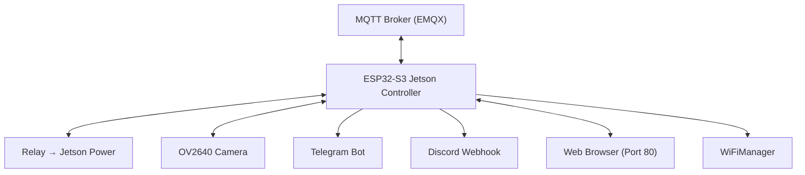

<h1 align="center">
📸 ESP32 Jetson Controller<br>
    <sub>Remote Power + Camera via MQTT, Telegram & Discord</sub>
</h1>

<p align="center">
  
</p>
<p align="center">
  <em>ESP32-S3 berbasis FREENOVE dengan kamera OV2640, kontrol relay power, capture foto otomatis, notifikasi Telegram, pengiriman foto ke Discord, MQTT control, dan web interface sederhana. Cocok untuk remote monitoring Jetson Nano / perangkat lain.</em>
</p>
<p align="center">
  
  
  
  
  
  
  
</p>

---

## 📋 Daftar Isi
- [Mengapa ESP32 Jetson Controller?](#-mengapa-esp32-jetson-controller)
- [Demo Singkat](#-demo-singkat)
- [Komponen Utama](#-komponen-utama-dan-fungsinya)
- [Software & Library](#-software--library)
- [Arsitektur Sistem](#-arsitektur-sistem)
- [Alur Kerja](#-alur-kerja-sistem)
- [Instalasi](#-instalasi)
- [Cara Menjalankan](#-cara-menjalankan)
- [Testing](#-testing)
- [Troubleshooting](#-troubleshooting)
- [Struktur Folder](#-struktur-folder)
- [Kontribusi](#-kontribusi)
- [Pengembang](#-pengembang)
- [Lisensi](#-lisensi)

---

## 🚀 Mengapa ESP32 untuk Jetson Controller?

### Keunggulan ESP32-S3 sebagai Remote Controller
| Fitur              | Keunggulan ESP32-S3                          | Manfaat |
|--------------------|---------------------------------------------|--------|
| **Kamera**         | Native Camera Interface + PSRAM             | Foto resolusi SVGA (JPEG) |
| **WiFi**           | Built-in + WiFiManager                      | Setup mudah tanpa kabel |
| **MQTT**           | PubSubClient + EMQX                         | Kontrol real-time relay & kamera |
| **Relay Control**  | GPIO + Power ON/OFF                         | Nyalakan/mematikan Jetson remotely |
| **Notifikasi**     | Telegram + Discord Webhook                  | Alert + foto langsung |
| **Web Server**     | Built-in WebServer                          | Kontrol manual via browser |
| **Memory**         | 8MB PSRAM + Flash                           | Buffer foto besar |

### Fitur Utama
✅ **Kontrol Relay** - Power ON/OFF Jetson Nano via MQTT atau web  
✅ **Capture Foto** - Ambil foto via MQTT atau tombol web  
✅ **Kirim ke Discord** - Foto langsung ke channel via webhook  
✅ **Notifikasi Telegram** - Status & alert real-time  
✅ **WiFiManager** - Setup WiFi via captive portal  
✅ **Web Interface** - Kontrol sederhana dari HP/Laptop  
✅ **MQTT Integration** - TOPIC_RELAY, TOPIC_CAMERA, TOPIC_STATUS  

---

## 📸 Demo Singkat

<p align="center">
  <em>ESP32 mengontrol power Jetson, mengambil foto kamera, mengirim ke Discord, dan mengirim notifikasi Telegram. Semua bisa dikontrol via MQTT atau web browser.</em>
</p>

<p align="center">
  <br/>
  <em>Demo: Relay control, foto capture, Discord + Telegram</em>
</p>

### Fitur Kontrol
- **MQTT** → `1/2/relay` (ON/OFF) dan `1/2/kamera` (CAPTURE)
- **Web** → `/on`, `/off`, `/capture`
- **Telegram** → Kirim status & alert
- **Discord** → Foto JPEG langsung ke webhook

---

## 🧩 Komponen Utama dan Fungsinya

| Komponen              | Fungsi                              | Keterangan |
|-----------------------|-------------------------------------|----------|
| **ESP32-S3 (FREENOVE)** | Otak utama + kamera                 | Camera interface + PSRAM |
| **Relay Module**      | Kontrol power Jetson                | Active LOW (GPIO 14) |
| **Kamera OV2640**     | Capture foto                        | FRAMESIZE_SVGA, JPEG |
| **LED Status**        | Indikator aktif                     | GPIO 2 |
| **WiFi Antenna**      | Koneksi internet                    | MQTT + HTTP |

---

## 💻 Software & Library

### Library yang Digunakan
| Library              | Fungsi |
|----------------------|--------|
| **WiFi.h**           | Koneksi WiFi |
| **WiFiManager.h**    | Auto connect + captive portal |
| **PubSubClient.h**   | MQTT client (EMQX) |
| **HTTPClient.h**     | Telegram & Discord webhook |
| **esp_camera.h**     | Driver kamera ESP32 |
| **WebServer.h**      | Web interface |

### Topik MQTT
- `1/2/relay` → `"ON"` atau `"OFF"`
- `1/2/kamera` → `"CAPTURE"`
- `1/2/status` → `"ONLINE"` (heartbeat)

---

## 🏗️ Arsitektur Sistem

### Diagram Blok


### Alur Utama
1. WiFiManager → Auto connect
2. MQTT connect + subscribe
3. Web server start
4. Siap terima perintah relay / capture

---

## ⚙️ Instalasi

### 1. Clone Repository
```bash
git clone https://github.com/ficrammanifur/esp32-jetson-controller.git
cd esp32-jetson-controller
```

### 2. Setup Arduino IDE
- Install **ESP32** board package (versi 2.0+ atau 3.0+)
- Install library via Library Manager:
  - `WiFiManager` by tzapu
  - `PubSubClient` by Nick O'Leary
  - Lainnya sudah built-in (HTTPClient, esp_camera)

### 3. Konfigurasi
Edit bagian **CONFIG** di `main.ino`:
```cpp
#define BOT_TOKEN "xxxxxxxx:AAH..." 
#define CHAT_ID   "xxxxxxxxx"
#define DISCORD_WEBHOOK "/api/webhooks/..."
```

### 4. Upload
- Board: **ESP32S3 Dev Module** (atau sesuai FREENOVE)
- PSRAM: **OPI PSRAM**
- Upload dan buka Serial Monitor (115200)

---

## 🚀 Cara Menjalankan

1. **Power ON** ESP32
2. Hubungkan ke WiFi via captive portal (`ESP32-Jetson-Control`)
3. Buka Serial Monitor untuk melihat IP
4. Akses web: `http://<IP>`
5. Kirim perintah via MQTT client (MQTT Explorer dll)

**Contoh Perintah MQTT:**
- Topic: `1/2/relay` → Payload: `ON`
- Topic: `1/2/kamera` → Payload: `CAPTURE`

---

## 🧪 Testing

- **Relay Test**: Kirim ON/OFF via MQTT atau web
- **Camera Test**: Tekan tombol Capture di web atau MQTT
- **Telegram**: Cek notifikasi saat startup / action
- **Discord**: Foto harus muncul di channel
- **Web Interface**: Buka di browser

---

## 🐞 Troubleshooting

**Kamera gagal init**
- Pastikan PSRAM di-enable di menu tools
- Cek pin definition sesuai FREENOVE ESP32-S3

**Tidak connect MQTT**
- Cek WiFi dan broker (`broker.emqx.io:1883`)

**Foto tidak terkirim ke Discord**
- Cek webhook URL (harus lengkap path)
- Pastikan boundary multipart benar

**Relay tidak nyala**
- Relay active LOW (digitalWrite LOW = ON)

---

## 📁 Struktur Folder
```
esp32-jetson-controller/
├── main.ino                 # Program utama
├── assets/                  # Gambar & banner
│   ├── esp32_jetson_controller_banner.png
│   └── demo.gif
├── README.md
└── LICENSE
```

---

## 🤝 Kontribusi
Kontribusi sangat diterima! Bisa tambah fitur:
- Tambah sensor suhu Jetson
- RTSP streaming
- Deep sleep mode
- Multi relay

---

<div align="center">
  
**Remote Power & Vision Controller for Jetson Nano**  
**ESP32-S3 + MQTT + Telegram + Discord**  
**Star this repo if you find it helpful!**  
<p><a href="#top">⬆ Back to Top</a></p>
</div>