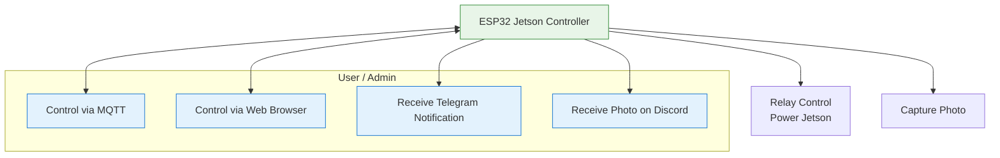
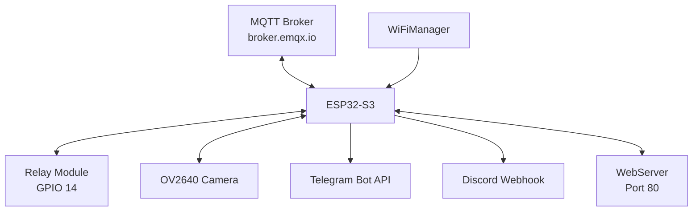
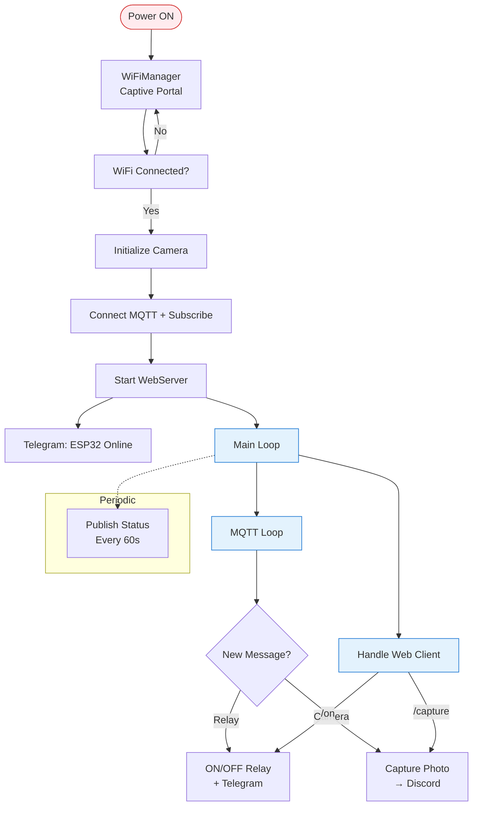

<h1 align="center">
📸 ESP32 Jetson Controller<br>
    <sub>Remote Power + Camera via MQTT, Telegram & Discord</sub>
</h1>

<p align="center">
  
</p>
<p align="center">
  <em>ESP32-S3 (FREENOVE) dengan kamera OV2640 untuk remote monitoring dan kontrol Jetson Nano. Fitur lengkap: relay power control, foto capture, notifikasi Telegram, kirim foto ke Discord, MQTT integration, dan web interface.</em>
</p>

<p align="center">
  
  
  
  
  
  
  
</p>

---

## 📋 Daftar Isi
- [Mengapa ESP32 Jetson Controller?](#-mengapa-esp32-jetson-controller)
- [Demo Singkat](#-demo-singkat)
- [Komponen Utama](#-komponen-utama-dan-fungsinya)
- [Wiring Diagram](#-wiring-diagram)
- [Software & Library](#-software--library)
- [Use Case Diagram](#-use-case-diagram)
- [Arsitektur Sistem](#-arsitektur-sistem)
- [Alur Kerja Sistem](#-alur-kerja-sistem)
- [Instalasi](#-instalasi)
- [Cara Menjalankan](#-cara-menjalankan)
- [Testing](#-testing)
- [Troubleshooting](#-troubleshooting)
- [Struktur Folder](#-struktur-folder)
- [Kontribusi](#-kontribusi)
- [Lisensi](#-lisensi)

---

## 🚀 Mengapa ESP32 Jetson Controller?

ESP32-S3 sangat cocok untuk proyek ini karena mendukung **kamera** secara native, PSRAM, WiFi stabil, dan cukup GPIO untuk relay + status LED.

**Fitur Utama:**
- Kontrol power Jetson (Relay)
- Capture & kirim foto ke Discord
- Notifikasi Telegram
- Kontrol via MQTT & Web Browser
- WiFiManager (setup mudah)

---

## 📸 Demo Singkat

*(Tambahkan GIF demo di sini nanti)*

---

## 🧩 Komponen Utama dan Fungsinya

| Komponen              | Fungsi                              | Pin |
|-----------------------|-------------------------------------|-----|
| ESP32-S3 (FREENOVE)   | Main Controller + Camera            | - |
| Relay Module          | Power ON/OFF Jetson                 | GPIO 14 |
| LED Status            | Indikator aktif                     | GPIO 2 |
| Kamera OV2640         | Ambil foto                          | Dedicated camera pins |

---

## 🔌 Wiring Diagram (ASCII)

```ascii
                     +---------------------+
                     |       ESP32-S3      |
                     |       FREENOVE      |
                     +----------+----------+
                                |
          +---------------------+--------------------+
          |                     |                    |
         3.3V                  GND                  5V (Relay VCC)
          |                     |                    |
          |                     |                    |
     +----+----+           +----+----+          +----+----+
     |  LED    |           |  Relay  |          |  Camera |
     | (GPIO 2)|           | (GPIO14)|          | OV2640  |
     +---------+           +---------+          +---------+
          |                     |                    |
         GND                   NO ───► Jetson Power   Camera Connector
                                COM ───► Jetson GND

Camera Pins (FREENOVE ESP32-S3):
+------------+-----------+
| Function   | GPIO      |
+------------+-----------+
| XCLK       | 15        |
| SIOD (SDA) | 4         |
| SIOC (SCL) | 5         |
| Y9         | 16        |
| Y8         | 17        |
| Y7         | 18        |
| Y6         | 12        |
| Y5         | 10        |
| Y4         | 8         |
| Y3         | 9         |
| Y2 (D0)    | 11        |
| VSYNC      | 6         |
| HREF       | 7         |
| PCLK       | 13        |
+------------+-----------+
```

---

## 💻 Software & Library

**Library:**
- `WiFi.h`
- `WiFiManager.h`
- `PubSubClient.h`
- `HTTPClient.h`
- `esp_camera.h`
- `WebServer.h`

**MQTT Topics:**
- `1/2/relay` → `ON` / `OFF`
- `1/2/kamera` → `CAPTURE`
- `1/2/status` → `ONLINE` (heartbeat)

---

## 📊 Use Case Diagram



---

## 🏗️ Arsitektur Sistem



---

## 🔄 Alur Kerja Sistem (Flowchart Lengkap)



---

## ⚙️ Instalasi

1. Clone repo
2. Install ESP32 board di Arduino IDE
3. Install library: **WiFiManager** & **PubSubClient**
4. Edit konfigurasi (BOT_TOKEN, CHAT_ID, Discord Webhook)
5. Pilih board **ESP32S3 Dev Module**, enable PSRAM → **OPI PSRAM**
6. Upload

---

## 🚀 Cara Menjalankan

1. Power ON ESP32
2. Connect ke WiFi via captive portal (`ESP32-Jetson-Control`)
3. Buka Serial Monitor (115200)
4. Akses web: `http://IP-ESP32`
5. Kontrol via MQTT atau web

---

## 🧪 Testing

- Test Relay (ON/OFF)
- Test Camera Capture
- Test Telegram & Discord
- Test Web Interface
- Test MQTT Command

---

## 🐞 Troubleshooting

**Kamera gagal init** → Pastikan PSRAM enabled  
**Relay tidak jalan** → Relay Active LOW  
**Foto tidak terkirim** → Cek Discord webhook URL  
**MQTT tidak connect** → Cek internet & broker

---

## 📁 Struktur Folder

```
esp32-jetson-controller/
├── main.ino
├── assets/
│   ├── banner.png
│   └── demo.gif
├── README.md
└── LICENSE
```

---

## 🤝 Kontribusi

Silakan fork dan buat Pull Request. Fitur yang bisa ditambahkan:
- RTSP Streaming
- Sensor suhu Jetson
- Notifikasi baterai/low power
- Multi relay

---

<div align="center">
<strong>ESP32-S3 Jetson Remote Controller</strong><br>
MQTT • Telegram • Discord • Camera • Relay<br><br>
⭐ Star repo ini jika bermanfaat!
</div>
